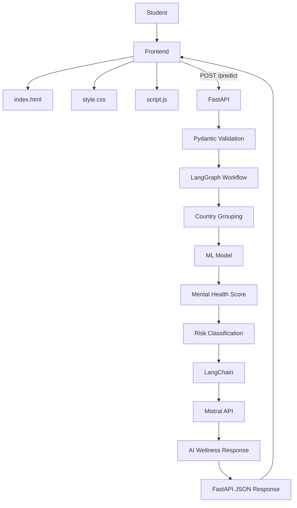
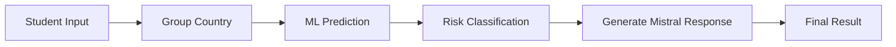
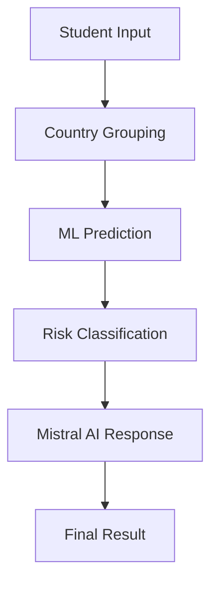
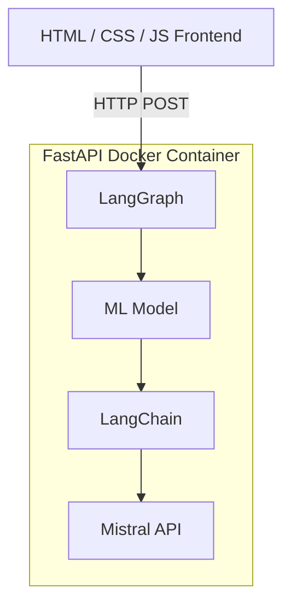
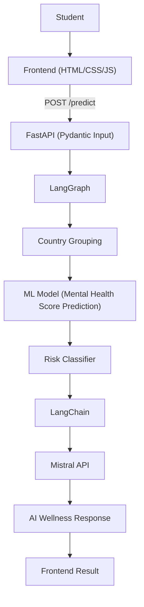

# 🧠 Student Mental Health AI

An end-to-end AI/ML application that predicts a **Student Mental Health Score** and generates supportive wellness guidance. The project combines **Machine Learning**, **FastAPI**, **LangGraph**, **LangChain**, **Mistral AI**, **Docker**, and a separate **HTML/CSS/JavaScript** frontend.

> ⚠️ **Disclaimer:** The predicted score is a machine-learning wellness indicator, **not** a medical diagnosis or a substitute for professional care.

---

## 📑 Table of Contents

- [Overview](#-overview)
- [System Architecture](#️-system-architecture)
- [LangGraph Workflow](#-langgraph-workflow)
- [Machine Learning](#-machine-learning)
- [Preprocessing](#-preprocessing)
- [Country Grouping](#-country-grouping)
- [Generative AI](#-generative-ai)
- [LangChain](#-langchain)
- [LangGraph](#️-langgraph)
- [FastAPI Backend](#-fastapi-backend)
- [Frontend](#-frontend)
- [Docker](#-docker)
- [Environment Variables](#-environment-variables)
- [Project Structure](#-project-structure)
- [Technology Stack](#️-technology-stack)
- [Installation](#-installation)
- [Build Docker Image](#-build-docker-image)
- [End-to-End Flow](#-end-to-end-flow)
- [Key Features](#-key-features)
- [Future Improvements](#-future-improvements)
- [Disclaimer](#️-disclaimer)
- [Author](#-author)

---

## 🚀 Overview

The student provides academic, social-media, lifestyle, and stress information. **FastAPI** validates the request, **LangGraph** orchestrates the workflow, the trained **ML model** predicts the Mental Health Score, and **Mistral** generates a supportive AI response.

---

## 🏗️ System Architecture



---

## 🔄 LangGraph Workflow



### Workflow Nodes

| Node | Purpose |
|---|---|
| `group_country` | Groups countries outside the selected top countries into `Other` |
| `ml_prediction` | Sends processed features to the trained ML model |
| `classify_risk` | Converts the predicted score into a risk category |
| `generate_response` | Uses LangChain + Mistral to generate supportive guidance |

---

## 🤖 Machine Learning

### Input Features

- Age
- Gender
- Country
- Academic Level
- Most Used Platform
- Purpose of Use
- Average Daily Usage Hours
- Daily Unlocks
- Study Hours
- Physical Activity Hours
- Sleep Hours Per Night
- Stress Level

### Target

`Mental_Health_Score`

## Models Compared

| Model | R² | Training R² | MAE | RMSE |
|---|---|---|---|---|
| Linear Regression | 0.7398 | 0.7237 | 0.5362 | 0.6760 |
| Random Forest (Default) | 0.8780 | 0.9809 | 0.3465 | 0.4629 |
| Random Forest (Tuned) | 0.8652 | 0.9547 | 0.3687 | 0.4865 |
| XGBoost (Default) | 0.8772 | 0.9752 | 0.3514 | 0.4645 |
| XGBoost (Tuned) | 0.8492 | 0.9104 | 0.4008 | 0.5146 |

*Values are from the model-comparison results shown in the project notebook.*

## Model Used

This project uses **Random Forest (Default)** as the final model.

| Metric | Score |
|---|---|
| R² | 0.8780 |
| MAE | 0.3465 |
| RMSE | 0.4629 |
### Evaluation Metrics

- **R²** — measures how well the model explains variation in the target.
- **MAE** — average absolute prediction error.
- **RMSE** — prediction error metric that penalizes larger errors more strongly.

---

## 🧹 Preprocessing

The project uses different preprocessing strategies for different feature types.

| Feature Type | Features |
|---|---|
| Skewed numerical | `Study_Hours` |
| Other numerical | `Age`, `Avg_Daily_Usage_Hours`, `Daily_Unlocks`, `Physical_Activity_Hours`, `Sleep_Hours_Per_Night` |
| Ordinal | `Stress_Level` |
| Categorical | `Gender`, `Academic_Level`, `Most_Used_Platform`, `Purpose_Of_Use`, `Grouped_Country` |

---

## 🌍 Country Grouping

The selected countries are:

`India`, `USA`, `Canada`, `Australia`, `UK`, `Germany`, `Mexico`, `Turkey`, `France`

Countries outside this list are grouped as **`Other`**.

---

## 🧠 Generative AI

After ML prediction, the application uses **Mistral AI** to generate a supportive natural-language response.

### AI Stack

- Mistral AI
- LangChain
- LangGraph
- Mistral API

The AI response is designed to explain the ML result in simple language and provide general wellness suggestions. It should **not** diagnose depression, anxiety, or other medical conditions, and it should **not** override the ML risk category.

---

## 🔗 LangChain

LangChain is used to integrate the Mistral chat model into the application.

```python
from langchain_mistralai import ChatMistralAI

llm = ChatMistralAI(
    model="mistral-small-latest",
    temperature=0.3,
    max_tokens=300
)
```

---

## 🕸️ LangGraph

LangGraph provides the structured workflow:



This separates the individual processing steps and makes the application easier to extend.

---

## ⚡ FastAPI Backend

FastAPI provides the REST API, request validation, model inference, LangGraph execution, Mistral integration, and JSON response.

**Endpoint:** `POST /predict`

**Example response:**

```json
{
  "mental_health_score": 7.25,
  "risk_category": "LOW",
  "ai_response": "..."
}
```

**Interactive API documentation:**

```
http://127.0.0.1:8000/docs
```

---

## 🎨 Frontend

The frontend is a separate static application built with:

- **HTML** — page structure and form
- **CSS** — styling and UI
- **JavaScript** — validation, API request, and result display

```
frontend/
├── index.html
├── style.css
└── script.js
```

The frontend sends the student's information to the FastAPI `/predict` endpoint.

---

## 🐳 Docker

The backend is Dockerized. The frontend does not need to be Dockerized because it is a static HTML/CSS/JavaScript application.



### Docker Image

Docker Hub repository:

```
https://hub.docker.com/r/pritesh077/student-mental-health-ai
```

Image:

```
pritesh077/student-mental-health-ai:v1
```

Pull the image:

```bash
docker pull pritesh077/student-mental-health-ai:v1
```

Run it:

```bash
docker run --env-file .env -p 8000:8000 pritesh077/student-mental-health-ai:v1
```

---

## 🔐 Environment Variables

Create a `.env` file:

```
MISTRAL_API_KEY=your_mistral_api_key
```

⚠️ Never commit `.env` or expose the Mistral API key in frontend JavaScript.

---

## 📁 Project Structure

```
student-mental-health-ai/
│
├── backend/
│   ├── llm/
│   │   └── prompts.py
│   ├── main.py
│   ├── Mental_Health_Model.pkl
│   └── schemas.py
│
├── frontend/
│   ├── index.html
│   ├── script.js
│   └── style.css
│
├── Graph/
│   ├── nodes.py
│   ├── state.py
│   └── workflow.py
│
├── .dockerignore
├── .env
├── dockerfile
├── mental_jwalth_score.ipynb
├── requirements.txt
└── Student Social Media And Mental Health Impact.csv
```

---

## 🛠️ Technology Stack

| Category | Technology |
|---|---|
| Language | Python |
| Data Processing | Pandas, NumPy |
| Machine Learning | Scikit-learn, XGBoost |
| Models | Linear Regression, Random Forest, XGBoost |
| Model File | `.pkl` |
| Backend | FastAPI |
| Validation | Pydantic |
| AI Workflow | LangGraph |
| LLM Framework | LangChain |
| LLM | Mistral AI |
| LLM API | Mistral API |
| Frontend | HTML, CSS, JavaScript |
| Server | Uvicorn |
| Containerization | Docker |

---

## 📦 Installation

Clone the repository:

```bash
git clone https://github.com/priteshbeladiya07/student-mental-health-ai.git
cd student-mental-health-ai
```

Create a virtual environment:

```bash
python -m venv .venv
```

Activate it (Windows):

```bash
.venv\Scripts\activate
```

Install dependencies:

```bash
pip install -r requirements.txt
```

Create `.env`:

```
MISTRAL_API_KEY=your_mistral_api_key
```

Start FastAPI:

```bash
uvicorn backend.main:app --reload
```

Open:

```
http://127.0.0.1:8000/docs
```

---

## 🐳 Build Docker Image

From the project root:

```bash
docker build -t student-mental-health:v1 .
```

Run:

```bash
docker run --env-file .env -p 8000:8000 student-mental-health:v1
```

---

## 🔄 End-to-End Flow



---

## ✨ Key Features

- Machine-learning-based Mental Health Score prediction
- Comparison of multiple regression models
- Numerical, categorical, and ordinal preprocessing
- Country grouping
- FastAPI REST API
- Pydantic validation
- LangGraph workflow
- LangChain integration
- Mistral API integration
- AI-generated wellness response
- HTML/CSS/JavaScript frontend
- Dockerized backend
- Docker Hub image
- Swagger API documentation

---

## ⚠️ Disclaimer

This application is for **educational and informational purposes**. The ML score is a wellness indicator and should not be interpreted as a clinical diagnosis. The AI response is not medical advice. Users with serious or immediate concerns should contact a qualified professional or appropriate local emergency/crisis support.

---

## 👨‍💻 Author

**Pritesh Beladiya**

- GitHub: [priteshbeladiya07](https://github.com/priteshbeladiya07)
- Docker Hub: [pritesh077](https://hub.docker.com/u/pritesh077)

---

## ⭐ Project Summary

```
Machine Learning + FastAPI + LangGraph + LangChain + Mistral AI + HTML/CSS/JavaScript + Docker
                              =
             End-to-End Student Mental Health AI
```
